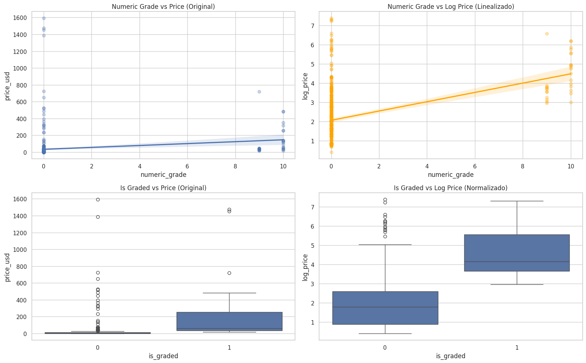

# Predicción de Precios de Cartas Pokémon

Proyecto académico desarrollado durante la asignatura Modelación y Simulación II del programa de Matemáticas.

El objetivo de este proyecto fue evaluar la capacidad de distintos modelos de machine learning para predecir el precio de cartas Pokémon a partir de características disponibles en el dataset.

---

## Objetivos

* Realizar análisis exploratorio de datos (EDA).
* Analizar la relación entre características y precio.
* Aplicar técnicas de preprocesamiento y transformación de datos.
* Explorar métodos de segmentación de mercado.
* Construir y comparar múltiples modelos predictivos.
* Analizar las limitaciones de los modelos y de los datos disponibles.

---

## Herramientas Utilizadas

* Python
* Pandas
* NumPy
* Matplotlib
* Scikit-Learn
* XGBoost
* CatBoost

---

## Modelos Evaluados

### Regresión

* Regresión Lineal
* Random Forest
* XGBoost
* CatBoost
* Stacking

### Segmentación

* K-Means
* PCA
* Clustering Jerárquico

---

## Análisis Exploratorio

### Distribución del Precio Original y Transformación Logarítmica


Se comparó la distribución original del precio con su transformación logarítmica para reducir asimetrías y mejorar el comportamiento de los modelos predictivos.

### Matriz de Correlación de Pearson


Se analizaron relaciones lineales entre variables numéricas utilizando el coeficiente de correlación de Pearson.

### Matriz de Correlación de Spearman


Se utilizaron correlaciones de Spearman para identificar relaciones monotónicas no necesariamente lineales.

### Calificación Numérica vs Precio



Se estudió la relación entre la calificación de una carta y su precio de mercado.

### Distribución de Precio Logarítmico por Rareza


Se exploró el impacto de la rareza sobre la distribución de precios utilizando la variable transformada.

---

## Segmentación de Mercado

### Método del Codo (K-Means)


Se utilizó el método del codo para estimar el número adecuado de clusters para la segmentación.

### Segmentación mediante PCA y K-Means


Se visualizaron grupos de cartas utilizando reducción de dimensionalidad con PCA y clustering mediante K-Means.

### Clustering Jerárquico


Se aplicó agrupamiento jerárquico para identificar posibles estructuras de mercado dentro del dataset.

---

## Importancia de Variables

### Comparación de Importancia de Características


Se comparó la relevancia de variables entre distintos modelos, incluyendo Random Forest, XGBoost y otros enfoques basados en aprendizaje supervisado.

---

## Comparación de Predicciones

### Predicciones vs Valores Reales


Se comparó el desempeño de los distintos modelos frente a los valores reales observados para evaluar capacidad predictiva y errores sistemáticos.

---

## Resultados

Los modelos lograron capturar parcialmente el comportamiento de los precios; sin embargo, la capacidad predictiva final fue limitada.

El proyecto permitió identificar factores importantes que afectan el rendimiento:

* Alta variabilidad inherente al mercado de cartas coleccionables.
* Variables relevantes ausentes en el dataset.
* Relaciones complejas difíciles de capturar únicamente con atributos disponibles.
* Limitaciones asociadas a calidad y estructura de los datos.

---

## Principales Conclusiones

* La calidad de los datos puede ser más importante que la complejidad del modelo.
* La transformación logarítmica mejoró la estabilidad de varias técnicas de regresión.
* Los métodos de ensemble ofrecieron mejoras respecto a modelos lineales tradicionales.
* Comprender por qué un modelo falla es tan valioso como obtener métricas elevadas.

---

## Estructura del Repositorio

```text
pokemon-price-prediction
│
├── README.md
├── README-ES.md
│
├── dataset/
│   └── pokemon_cards_dataset.csv
│
├── notebooks/
│   └── pokemon_price_prediction.ipynb
│
├── images/
│   ├── price_distribution.png
│   ├── pearson_correlation.png
│   ├── spearman_correlation.png
│   ├── grade_vs_price.png
│   ├── log_price_rarity.png
│   ├── elbow_method.png
│   ├── pca_segmentation.png
│   ├── hierarchical_clustering.png
│   ├── feature_importance.png
│   └── model_predictions.png
```

---

## Autor

Jacobo Lopez

Estudiante de Matemáticas

Fundación Universitaria Konrad Lorenz

Colombia
