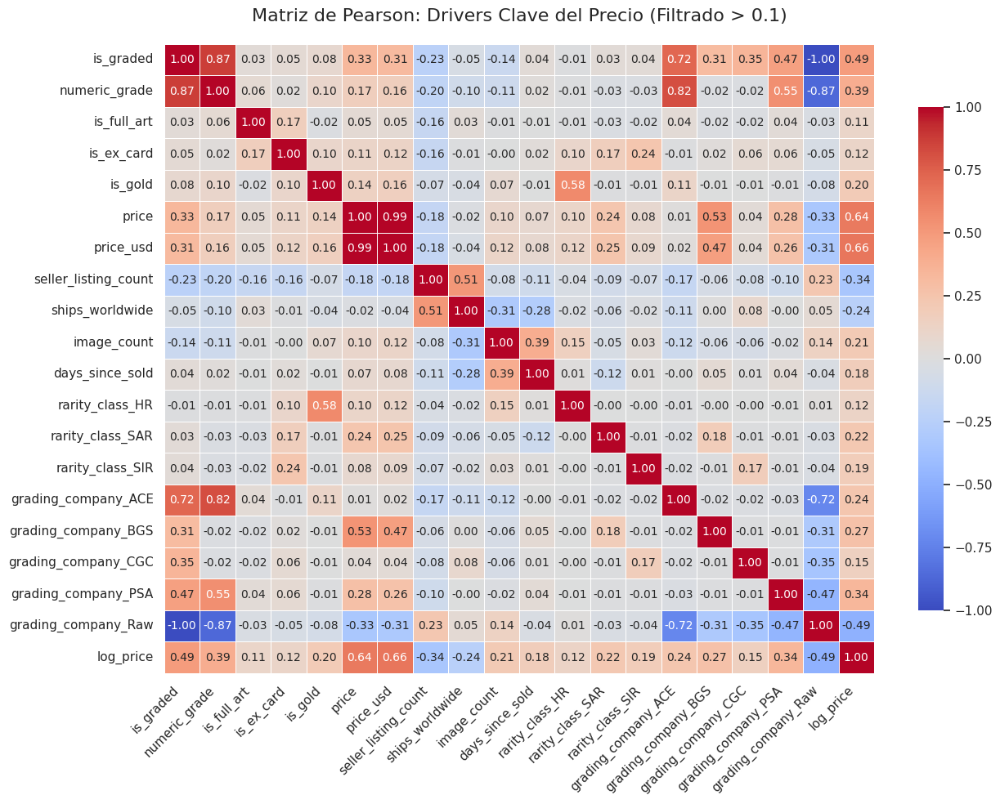
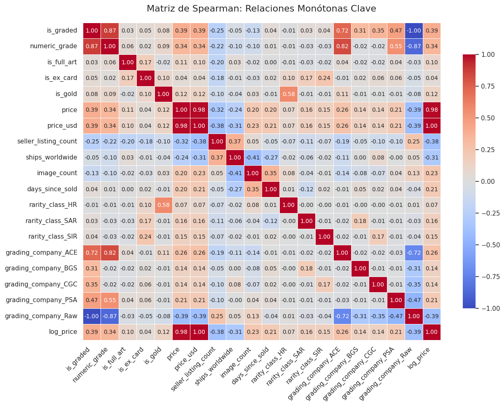
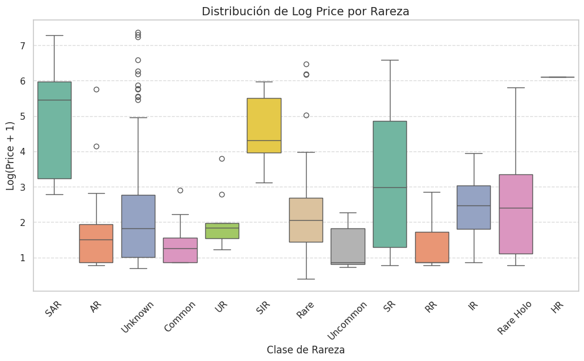
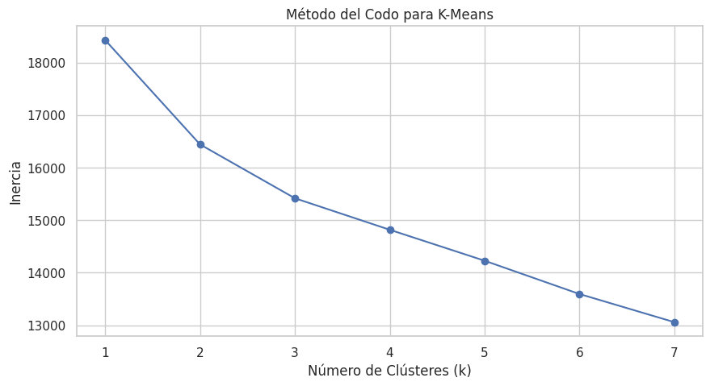
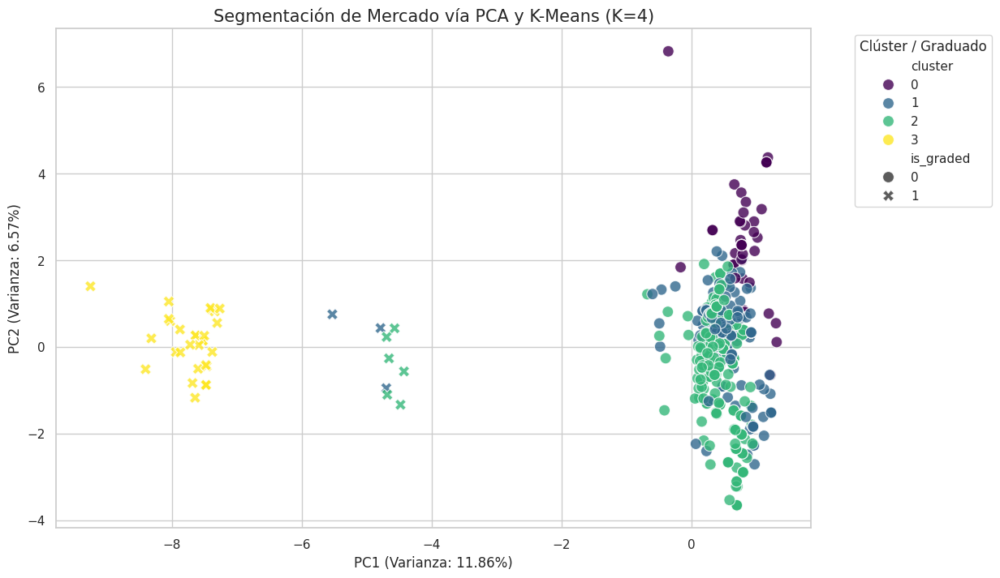
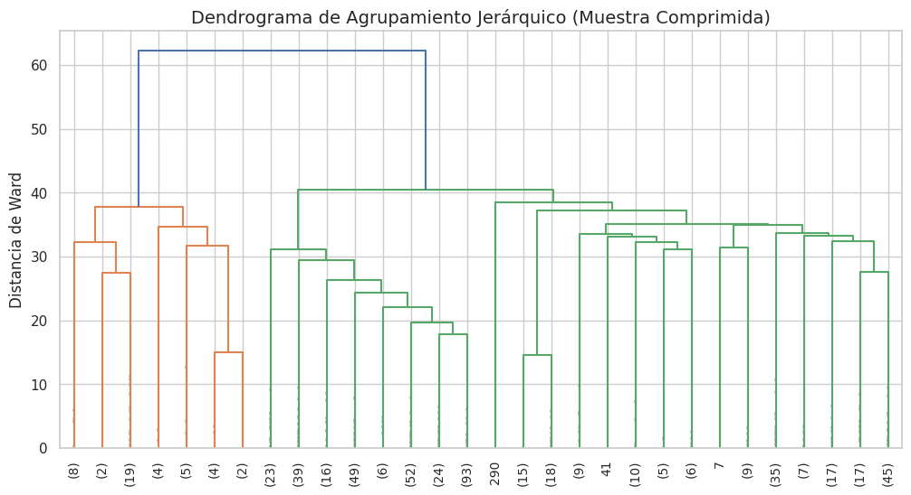
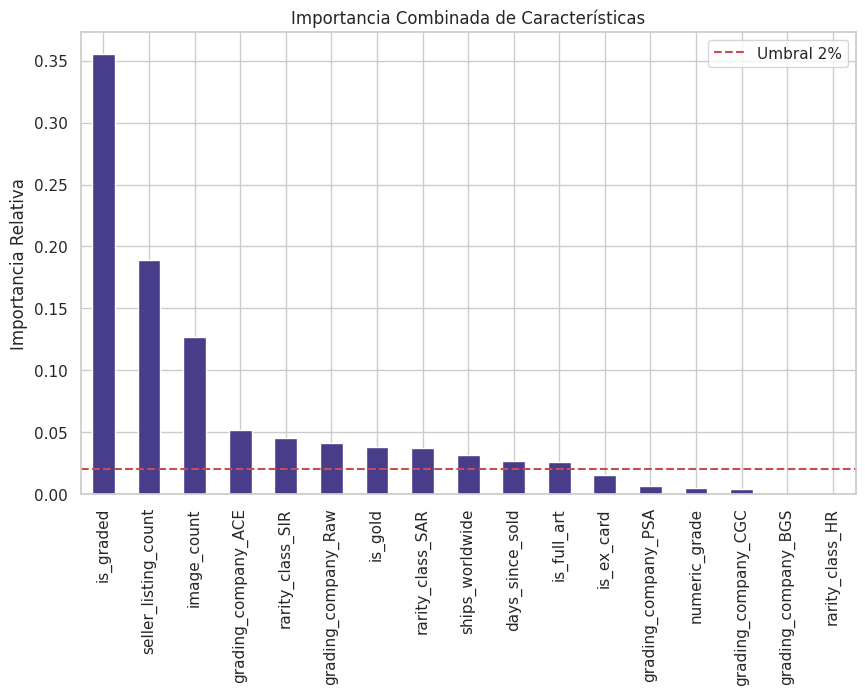

# Pokémon Price Prediction

Academic machine learning project developed during the Modeling and Simulation II course as part of the Mathematics undergraduate program.

The objective of this project was to evaluate whether Pokémon card prices can be accurately predicted using the information available in a public dataset and to identify the factors that most influence market value.

---

## Project Objectives

- Perform exploratory data analysis (EDA).
- Analyze the relationship between card characteristics and market price.
- Apply clustering techniques to identify market segments.
- Compare multiple machine learning approaches.
- Evaluate model performance using regression metrics.
- Understand the limitations of predictive modeling in collectible markets.

---

## Dataset Characteristics

The dataset contains information about Pokémon trading cards, including:

- Card rarity
- Grade and condition
- Release information
- Market-related attributes
- Price information (target variable)

The target variable was:

```text
priceUSD
```

---

## Exploratory Data Analysis

Several exploratory techniques were applied to understand the structure of the dataset and the behavior of card prices.

### Price Distribution


The original price distribution showed strong skewness. A logarithmic transformation was applied to improve model stability and reduce the influence of extreme values.

### Pearson Correlation Matrix



Linear relationships between numerical variables were analyzed using Pearson correlation coefficients.

### Spearman Correlation Matrix



Spearman correlation was used to identify monotonic relationships that may not be strictly linear.

### Grade vs Price


Card grade showed a strong relationship with market value, confirming the importance of condition in collectible pricing.

### Rarity vs Log Price



Different rarity categories exhibited distinct price distributions, highlighting the influence of scarcity on market value.

---

## Market Segmentation

### K-Means Elbow Method



The elbow method was used to identify a suitable number of clusters for market segmentation.

### PCA Market Segmentation



Principal Component Analysis (PCA) was used to visualize clusters and identify potential market segments among Pokémon cards.

### Hierarchical Clustering



Hierarchical clustering was performed to explore alternative grouping structures within the dataset.

---

## Machine Learning Models Evaluated

The following predictive models were tested:

- Linear Regression
- Random Forest Regressor
- XGBoost
- CatBoost
- Support Vector Regression (SVR)
- Stacking Models

Hyperparameter optimization was performed using grid search techniques.

---

## Feature Importance Analysis



Feature importance analysis was conducted using multiple models to identify the variables with the greatest influence on card prices.

---

## Results

Although several machine learning approaches were evaluated, none achieved sufficiently strong predictive performance to reliably estimate Pokémon card prices.

The project revealed that:

- Market prices are influenced by factors not fully represented in the dataset.
- Data quality and feature availability strongly limit predictive accuracy.
- Increasing model complexity does not necessarily solve information deficiencies.
- Market behavior for collectible assets can be difficult to capture using structured variables alone.

---

## Key Takeaways

- Data understanding is often more important than model complexity.
- Feature engineering plays a critical role in predictive modeling.
- Clustering can reveal meaningful market segments even when prediction performance is limited.
- A negative result can still generate valuable analytical insights.

---

## Technologies Used

- Python
- Pandas
- NumPy
- Matplotlib
- Scikit-Learn
- XGBoost
- CatBoost

---

## Author

Jacobo Lopez

Mathematics Undergraduate Student

Fundación Universitaria Konrad Lorenz

Colombia
